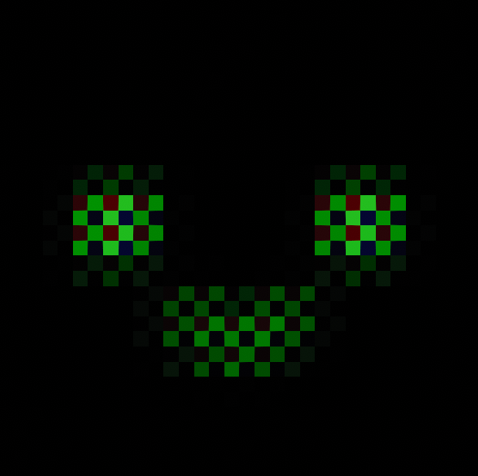

<div align="center">



# RE_PPG

**Restoring C# Mod Compilation to People Playground**

[](https://github.com/AlibardaWasTaken/RE_PPG-The-community-mod-loader/releases/latest)
[](https://store.steampowered.com/app/1118200/People_Playground/)
[](https://github.com/AlibardaWasTaken/RE_PPG-The-community-mod-loader)
[](https://github.com/AlibardaWasTaken/RE_PPG-The-community-mod-loader)
[](https://github.com/AlibardaWasTaken/RE_PPG-The-community-mod-loader)

<p align="center">
  <a href="#why-re_ppg-exists">Why RE_PPG Exists</a> •
  <a href="#security--disclaimer">Security & Disclaimer</a> •
  <a href="#installation">Installation</a> •
  <a href="#for-mod-developers">For Developers</a> •
  <a href="#in-game-overlay-f10">In-Game Overlay</a> •
  <a href="#troubleshooting--faq">FAQ</a> •
  <a href="#credits">Credits</a>
</p>

---

</div>

## Why RE_PPG Exists

In People Playground 1.27, the developer **completely deleted the C# mod compiler from the game** after multiple incidents where malicious Steam Workshop items were used to distribute malware. As a result, script-based C# modding stopped working entirely.

**RE_PPG restores the deleted compiler back to the game.**

Built on the game's original compiler pipeline, RE_PPG re-integrates the compilation workflow via BepInEx and updates it:
- **Restored Out-of-Process Compiler**: Re-enables the external compiler process (`RE_PPG.Compiler.exe`), allowing People Playground to compile and load C# mods again.
- **Modern Roslyn Tooling**: Uses Microsoft Roslyn, enabling modders to write modern C# syntax (file-scoped namespaces, pattern matching, switch expressions, target-typed `new()`, etc.).
- **Improved Safety Filters**: Scans mod source code before compilation to intercept overt red flags (spawning external system processes, suspicious filesystem navigation outside the game folder) with an explicit "Trust & Run" confirmation.
- **Signed Background Updates**: Seamless background updates for the RE_PPG runtime itself, cryptographically signed with RSA-3072.

---

## ⚠️ Security & Disclaimer

> ### IMPORTANT: USE AT YOUR OWN RISK
> **RE_PPG is NOT an impenetrable shield or an airtight sandbox.**
>
> Due to the inherent architecture of Unity and the Mono/C# runtime, creating an absolute 100% security sandbox without breaking legitimate mod functionality is technically impossible.
>
> **Whatever mods you choose to install and run are entirely your own responsibility.**

### What the Safety Filters Do
- **Static Syntax Tree (AST) Inspection**: Before compiling, RE_PPG scans the mod's source code for high-risk operations.
- **Flags Suspicious APIs**: Intercepts overt red flags, such as:
  - Spawning external system processes (`cmd.exe`, `powershell.exe`, hidden executables).
  - Navigating or modifying directories outside the game folder.
  - Opening raw low-level network sockets.
- **"Trust and Run" Confirmation**: If a mod trips a heuristic check or requests elevated system calls, RE_PPG pauses execution and prompts you in-game. The mod will **not** run unless you explicitly choose to trust it.

### What They Cannot Do
- Static heuristics cannot guarantee protection against every obfuscated or indirect exploit.
- **Rule of Thumb**: Only install mods from authors and sources you trust. If RE_PPG flags a mod as suspicious, do not click **"Trust and Run"** unless you have reviewed the code or trust the creator.

---

## Installation

Choose the installation method that best fits your environment:

### Option 1: Standalone Installer (Recommended)
> *Self-contained executable. Requires no pre-installed dependencies.*

1. Download **`RE_PPG-Installer.exe`** from the [Latest Release](https://github.com/AlibardaWasTaken/RE_PPG-The-community-mod-loader/releases/latest).
2. Launch the installer. It will automatically detect your People Playground Steam installation.
3. Click **Install RE_PPG**. The installer configures BepInEx 5.4.23.5 and the latest RE_PPG package automatically.
4. Launch People Playground through Steam.

---

### Option 2: Lightweight Installer (For systems with .NET 10)
> *Ultra-compact (~1.3 MB) installer for users who already have .NET 10 installed.*

1. Ensure the **Windows x64 [.NET 10 Desktop Runtime](https://dotnet.microsoft.com/download/dotnet/10.0)** is installed. The regular .NET Runtime alone does not include WPF.
2. Download and run **`RE_PPG-Installer-net10.exe`** from the [Latest Release](https://github.com/AlibardaWasTaken/RE_PPG-The-community-mod-loader/releases/latest).
3. Follow the on-screen prompt to install.

If the required runtime is missing, Windows shows a .NET launch dialog with a download button before the installer opens. Download and install the suggested Desktop Runtime, then launch `RE_PPG-Installer-net10.exe` again. Alternatively, use the standalone `RE_PPG-Installer.exe`, which includes its runtime.

---

### Option 3: Manual Installation
> *For manual setups, portable environments, or custom modding managers.*

1. Install **[BepInEx 5.4.23.5 (x64 Mono)](https://github.com/BepInEx/BepInEx/releases/tag/v5.4.23.5)** into your People Playground root directory.
2. Download **`RE_PPG-base.zip`** from the [Latest Release](https://github.com/AlibardaWasTaken/RE_PPG-The-community-mod-loader/releases/latest).
3. Extract `RE_PPG-base.zip` into the root directory of People Playground (merging `BepInEx/` and `RE_PPG/` folders).
4. Launch the game normally.

---

## For Mod Developers

Mod creation in RE_PPG follows the standard People Playground layout:

### Folder Structure
```text
People Playground/
└── Mods/
    └── MyCustomMod/
        ├── mod.json
        └── Scripts/
            ├── Entry.cs
            └── Mechanics.cs
```

### Modern C# Syntax
Write clean and expressive C# code right out of the box:

```csharp
using UnityEngine;

namespace NextGenMod;

public class ModEntry : MonoBehaviour
{
    public static void Main()
    {
        var message = System.DateTime.Now.Hour switch
        {
            < 12 => "Good morning from RE_PPG!",
            < 18 => "Good afternoon from RE_PPG!",
            _ => "Good evening from RE_PPG!"
        };

        ModAPI.Notify(message);
    }
}
```

Supported syntax features include:
- **File-scoped namespaces** (`namespace MyMod;`)
- **Pattern matching & switch expressions**
- **Target-typed `new()` expressions**
- **Null-conditional & null-coalescing assignments** (`??=`)
- **Expression-bodied members & local functions**

---

## In-Game Overlay (`F10`)

Press **`F10`** while in-game to open the **RE_PPG Updater**:

- View the running release and the result of the last update operation.
- Check for updates immediately.
- Import an offline package from paths configured in `community.re_ppg.mods.cfg`.
- Select the previous release for the next game start.
- Find the updater log path.

Mod launch confirmations and **Trust and run** are available in the game's mod menu.

---

## Troubleshooting & FAQ

<details>
<summary><b>Windows Defender or SmartScreen warns that the installer is unknown</b></summary>
<br>
The standalone installer (<code>RE_PPG-Installer.exe</code>) is compiled as a self-contained single-file binary using .NET, which frequently triggers false-positive heuristic flags on newly released builds. Click <b>More info</b> &rarr; <b>Run anyway</b>.
</details>

<details>
<summary><b>The lightweight installer asks to install or update .NET</b></summary>
<br>
Install the Windows x64 .NET 10 Desktop Runtime using the download button in the launch dialog:
<ol>
  <li>Download and run the Microsoft Desktop Runtime installer.</li>
  <li>Launch <code>RE_PPG-Installer-net10.exe</code> again.</li>
  <li>If you prefer not to install .NET separately, use <code>RE_PPG-Installer.exe</code>.</li>
</ol>
</details>

<details>
<summary><b>How do I temporarily disable RE_PPG without uninstalling?</b></summary>
<br>
Create an empty file named <code>disable-runtime.flag</code> inside the <code>RE_PPG/</code> folder in your People Playground installation directory. Remove or rename the file when you want to enable RE_PPG again.
</details>

<details>
<summary><b>Where are the log files located?</b></summary>
<br>
<ul>
  <li><b>In-Game & Mod Logs:</b> <code>People Playground/BepInEx/LogOutput.log</code></li>
  <li><b>Compiler Cache & Build Logs:</b> <code>%LOCALAPPDATA%/RE_PPG/local-mods/&lt;GameIdentifier&gt;/</code></li>
  <li><b>Updater Logs:</b> <code>%LOCALAPPDATA%/RE_PPG/local-mods/&lt;GameIdentifier&gt;/updates/updater.log</code> by default; the F10 window shows the configured path.</li>
</ul>
</details>

---

## Credits

- **Authors**: dyad & alibarda
- **Security & Access Architecture**: Inspired by the architectural work of [s&box](https://sbox.game/) by Facepunch Studios Ltd (Licensed under MIT).
- **Core Technologies**: [Microsoft Roslyn](https://github.com/dotnet/roslyn), [BepInEx](https://github.com/BepInEx/BepInEx), [Mono.Cecil](https://github.com/jbevain/cecil).
